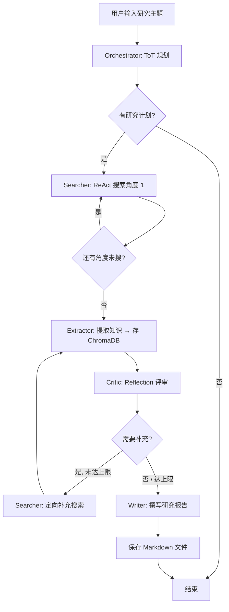

# 智能研究助手系统 — 使用说明

> **Multi-Agent Research System powered by LangGraph**  
> 5 个 Agent | 3 种推理方法 | 2 种记忆系统 | 3 个工具

---

## 目录

1. [系统概述](#1-系统概述)
2. [环境要求](#2-环境要求)
3. [快速开始](#3-快速开始)
4. [架构详解](#4-架构详解)
5. [配置说明](#5-配置说明)
6. [工作流程](#6-工作流程)
7. [输出产物](#7-输出产物)
8. [常见问题](#8-常见问题)

---

## 1. 系统概述

本系统是一个基于 **LangGraph** 的多智能体协作研究助手。你只需输入一个研究主题，系统会自动完成：

- 🧠 **任务分解**：使用 ToT（Tree of Thoughts）将主题拆解为多个研究角度
- 🔍 **信息检索**：使用 ReAct（推理+行动）循环在互联网上搜索资料
- 📖 **知识提取**：从搜索结果中提取结构化事实，存入长期记忆
- 🤔 **质量评审**：使用 Reflection（反思）方法评估研究质量，发现空白并自动补充
- ✍️ **报告生成**：综合所有发现生成专业的 Markdown 研究报告

**核心特色**：系统会**自动迭代**——评审发现信息不足时，会自动重新搜索补充，直到达到满意的研究质量。

---

## 2. 环境要求

### 2.1 必备软件

| 软件 | 版本要求 |
|------|----------|
| Python | 3.10+ |
| uv | 最新版 |

### 2.2 安装 uv

```powershell
# Windows PowerShell
powershell -c "irm https://astral.sh/uv/install.ps1 | iex"
```

### 2.3 安装项目依赖

```bash
cd ResearchAgentSystem
uv sync
```

uv 会自动创建 `.venv` 虚拟环境并安装所有依赖，一键完成，无需手动管理 conda 环境。

| 包名 | 用途 |
|------|------|
| `langchain` | LCEL 核心框架、消息类型、工具装饰器 |
| `langchain-openai` | ChatOpenAI（兼容所有 OpenAI 格式 API） |
| `langgraph` | 状态图引擎、条件路由、检查点 |
| `chromadb` | 向量数据库（长期记忆持久化存储） |
| `sentence-transformers` | 嵌入模型（文本 → 向量） |
| `ddgs` | DuckDuckGo 免费搜索 API |

### 2.4 API Key

本系统使用兼容 OpenAI 格式的 LLM API，默认对接阿里云 **DashScope**（通义千问）。你也可以换成 OpenAI、Ollama、vLLM 等任何兼容服务。

设置环境变量（推荐）：

```powershell
# Windows PowerShell — DashScope（通义千问，默认）
$env:LLM_API_KEY = "你的DashScope API Key"
$env:LLM_BASE_URL = "https://dashscope.aliyuncs.com/compatible-mode/v1"
$env:LLM_MODEL_NAME = "qwen-plus"
$env:LLM_LIGHT_MODEL_NAME = "qwen-turbo"

# 或使用 OpenAI
$env:LLM_API_KEY = "sk-..."
$env:LLM_BASE_URL = "https://api.openai.com/v1"
$env:LLM_MODEL_NAME = "gpt-4o"
$env:LLM_LIGHT_MODEL_NAME = "gpt-4o-mini"

# 或使用本地 Ollama
$env:LLM_API_KEY = "ollama"
$env:LLM_BASE_URL = "http://localhost:11434/v1"
$env:LLM_MODEL_NAME = "qwen2.5:7b"
$env:LLM_LIGHT_MODEL_NAME = "qwen2.5:1.5b"
```

> 💡 也可以直接修改 `config.py` 中的默认值（`LLM_API_KEY`、`LLM_BASE_URL` 等）。

### 2.5 网络要求

- 需要能够访问 DuckDuckGo 搜索（用于网页检索）
- 需要能够访问LLM API服务

---

## 3. 快速开始

### 3.1 命令行运行

```bash
cd ResearchAgentSystem

# 基本用法：指定研究主题
uv run python main.py "人工智能在教育领域的应用"
```

### 3.2 交互式运行

```bash
uv run python main.py
```

然后根据提示输入研究主题（直接按 Enter 使用默认示例主题）。

### 3.3 运行示例

```bash
# 研究科技话题
uv run python main.py "量子计算的最新进展"

# 研究体育话题
uv run python main.py "乒乓球运动员早田希娜的球风与打法"

# 研究经济话题
uv run python main.py "2024年新能源汽车市场趋势"
```

```bash
# 研究科技话题
python main.py -t "量子计算的最新进展"

# 研究体育话题（跨会话保留记忆，第二次运行能检索到上次的研究成果）
python main.py -t "乒乓球运动员早田希娜的球风与打法"

# 研究经济话题（清空旧记忆从零开始）
python main.py -t "2024年新能源汽车市场趋势" --clear-memory
```

---

## 4. 架构详解

### 4.1 五个 Agent

| Agent | 角色 | 推理方法 | 职责 |
|-------|------|----------|------|
| **Orchestrator** 🌳 | 研究协调者 | **ToT**（思维树） | 分解主题为 6 个角度 → 评分 → 选优 3 个 |
| **Searcher** 🔍 | 信息检索员 | **ReAct**（推理行动） | 自主决定搜什么、何时停，调用 web_search / rag_retrieve |
| **Extractor** 📖 | 知识提取员 | LLM 结构化提取 | 从搜索结果提取事实/数据/观点，存入 ChromaDB |
| **Critic** 🤔 | 研究评审员 | **Reflection**（反思） | 四维评审（完整性/准确性/相关性/深度），发现空白→触发补充搜索 |
| **Writer** ✍️ | 报告撰写员 | LLM 综合生成 | 整合所有发现，生成带真实引用的 Markdown 报告 |

### 4.2 三种推理方法

```
ToT (Tree of Thoughts)
    ├── 探索：生成 6 个研究角度分支
    ├── 评估：对每个分支打分（可行性/重要性/深度）
    └── 选择：选出最优 3 个角度

ReAct (Reasoning + Acting)
    Thought → Action → Observation → Thought → ...
    └── LLM 自主决定工具调用时机和参数

Reflection
    └── 评估→识别空白→定向补充→再评估（最多 4 轮）
```

### 4.3 两种记忆系统

| 记忆类型 | 技术 | 作用 |
|----------|------|------|
| **短期记忆** | 内存缓冲区 + LLM 摘要压缩 | 保存会话内的对话/思维轨迹，窗口大小 10 条 |
| **长期记忆** | ChromaDB 向量数据库 + `all-MiniLM-L6-v2` 嵌入 | 持久化存储知识/反思/报告，支持语义检索 |

### 4.4 三个工具

| 工具 | 功能 |
|------|------|
| `web_search` | DuckDuckGo 互联网搜索（免费无 API Key） |
| `rag_retrieve` | 从 ChromaDB 长期记忆检索相关历史资料 |
| `calculate` | 安全的数学表达式计算（统计/科学计算） |

### 4.5 文件结构

```
ResearchAgentSystem/
├── main.py              # 主入口：交互式/命令行运行
├── config.py            # 所有配置项（模型/记忆/Agent/工具）
├── state.py             # LangGraph 全局状态定义
├── graph.py             # LangGraph 图构建 + 条件路由
├── utils.py             # 日志美化、格式化输出、报告保存
├── agents/
│   ├── orchestrator.py  # ToT 规划 Agent
│   ├── searcher.py      # ReAct 搜索 Agent
│   ├── extractor.py     # 知识提取 Agent
│   ├── critic.py        # Reflection 评审 Agent
│   └── writer.py        # 报告撰写 Agent
├── memory/
│   ├── short_term.py    # 短期记忆（窗口缓冲+摘要）
│   └── long_term.py     # 长期记忆（ChromaDB 向量存储）
├── tools/
│   ├── web_search.py    # DuckDuckGo 搜索工具
│   ├── rag_retrieve.py  # RAG 检索工具
│   └── calculator.py    # 安全计算工具
└── chroma_db/           # ChromaDB 持久化数据（自动生成）
```

---

## 5. 配置说明

所有配置集中在 `config.py` 中，核心参数如下：

### 5.1 模型配置

```python
MODEL_NAME = "qwen-plus"          # 主模型（推理/规划/生成）
LIGHT_MODEL_NAME = "qwen-turbo"   # 轻量模型（摘要/评分）
MODEL_TEMPERATURE = 0.7           # 主模型温度
LIGHT_MODEL_TEMPERATURE = 0.3     # 轻量模型温度
EMBEDDING_MODEL = "text-embedding-v1"  # 嵌入模型
```

### 5.2 Agent 配置

```python
TOT_NUM_BRANCHES = 6      # ToT 生成的研究角度数量
TOT_TOP_K = 3              # 选择的最佳分支数量
MAX_REACT_ITERATIONS = 5   # ReAct 最大迭代次数
MAX_REFLECTION_ROUNDS = 4  # 最大反思-重新搜索循环次数
```

### 5.3 记忆配置

```python
SHORT_TERM_WINDOW_SIZE = 10       # 短期记忆窗口
SHORT_TERM_SUMMARY_THRESHOLD = 15 # 触发摘要压缩的阈值
RETRIEVAL_TOP_K = 5               # RAG 检索返回数量
RETRIEVAL_SCORE_THRESHOLD = 0.3   # 相似度阈值
```

### 5.4 工具配置

```python
WEB_SEARCH_MAX_RESULTS = 5   # 每次搜索返回结果数
CALCULATOR_MAX_DIGITS = 10   # 计算器精度
VERBOSE = True               # 是否打印详细日志（调试建议开启）
```

---

## 6. 工作流程

### 6.1 完整流程图



### 6.2 各阶段说明

| 阶段 | 输入 | 输出 | 耗时（估计） |
|------|------|------|-------------|
| ToT 规划 | 研究主题 | 3 个研究角度 + 关键词 | ~5s |
| ReAct 搜索 | 研究角度 × 3 | 每组搜索轨迹 + 摘要 | ~30-60s |
| 知识提取 | 全部搜索结果 | 结构化事实列表 + 存入 ChromaDB | ~10s |
| Reflection 评审 | 事实 + 计划 | 评审报告 + 空白识别 | ~10s |
| 补充搜索（可选） | 空白查询 | 补充搜索结果 | ~10-20s |
| 报告撰写 | 所有发现 | Markdown 研究报告 | ~15s |

---

## 7. 输出产物

### 7.1 控制台输出

运行时会实时显示详细的执行日志，包括：

- 🌳 ToT 的角度生成、评分、选择
- 🔍 ReAct 每轮的 Thought/Action/Observation
- 📖 知识提取的数量和分类
- 🤔 评审分数、优点、不足、空白
- 📊 最终状态摘要

### 7.2 研究报告文件

报告自动保存为 Markdown 文件：

```
research_report_{主题}_{时间戳}.md
```

例如：`research_report_人工智能在教育领域的应用_20260708_120000.md`

报告结构：

```markdown
# 研究报告: {主题}
├── 摘要
├── 引言
├── 研究方法
├── 分角度详细分析
│   ├── 角度1
│   ├── 角度2
│   └── 角度3
├── 综合讨论
├── 结论
├── 研究局限性
└── 参考文献（真实可用的 URL）
```

### 7.3 长期记忆数据

`chroma_db/` 目录存储了向量化的研究记录，可以在后续研究中通过 RAG 检索复用。

---

## 8. 常见问题

### Q1: 运行报错 `DuckDuckGo 库未安装`

```bash
pip install duckduckgo-search ddgs
```

### Q2: 运行报错 `chromadb` 相关错误

```bash
pip install chromadb sentence-transformers
```

### Q3: API 调用失败 / Key 无效

1. 检查 `config.py` 中 `LLM_API_KEY` 是否正确
2. 确认 DashScope 账户余额充足
3. 检查网络是否能访问 `dashscope.aliyuncs.com`

### Q4: 搜索无结果或结果很少

- DuckDuckGo 在某些网络环境下可能被限速
- 尝试使用更具体的中文关键词
- 可以在 `config.py` 中调大 `WEB_SEARCH_MAX_RESULTS`

### Q5: 如何关闭详细日志？

在 `config.py` 中将 `VERBOSE = False`。

### Q6: 如何调整研究深度？

- 增加角度数：调大 `TOT_NUM_BRANCHES` 和 `TOT_TOP_K`
- 增加搜索轮次：调大 `MAX_REACT_ITERATIONS`
- 增加反思迭代：调大 `MAX_REFLECTION_ROUNDS`

### Q7: 如何更换其他 LLM？

修改环境变量或 `config.py` 中的 `LLM_BASE_URL`、`LLM_API_KEY` 和 `MODEL_NAME`，支持任何兼容 OpenAI 格式的 API（如 OpenAI、Ollama、vLLM 等）。

```python
# 示例：切换到 Ollama 本地模型
LLM_BASE_URL = "http://localhost:11434/v1"
MODEL_NAME = "qwen2.5:7b"
LLM_API_KEY = "ollama"  # Ollama 不需要真实 key
```

---

> 📝 **提示**：系统默认跨会话保留长期记忆。如需每次启动清空记忆，使用 `--clear-memory` 参数或在 `config.py` 中设置 `CLEAR_MEMORY_ON_START = True`。
